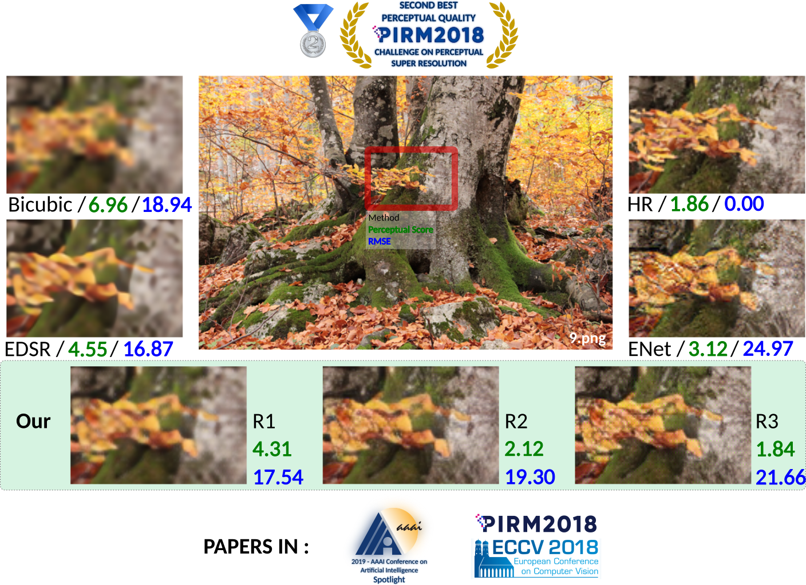

## Multigrid Backprojection Super Resolution
[Pablo Navarrete Michelini](pnavarre@boe.com.cn), [Dan Zhu](zhudan@boe.com.cn) and [Hanwen Liu](lhw@boe.com.cn)

    

### Citation

[Pablo Navarrete Michelini, Hanwen Liu and Dan Zhu, "Multigrid Backprojection Super-Resolution and Deep Filter Visualization", to appear in the Thirty-Third AAAI Conference on Artificial Intelligence (AAAI-19)](https://www.researchgate.net/publication/327881763_Mutigrid_Backprojection_Super-Resolution_and_Deep_Filter_Visualization)

[Pablo Navarrete Michelini, Dan Zhu and Hanwen Liu, "Multi-Scale Recursive and Perception-Distortion Controllable Image Super-Resolution", in The European Conference on Computer Vision Workshops (ECCVW), 2018.](https://www.researchgate.net/publication/327979709_Multi-Scale_Recursive_and_Perception-Distortion_Controllable_Image_Super-Resolution)

#### BibTeX MGBP (AAAI-19)
    @inproceedings{MGBP,
        title        = {Multigrid Backprojection Super--Resolution and Deep Filter Visualization},
        author       = {Navarrete~Michelini, Pablo and Liu, Hanwen and Zhu, Dan},
        booktitle    = {Proceedings of the Thirty--Third AAAI Conference on Artificial Intelligence (AAAI 2019)},
        year         = {2019},
        organization = {AAAI},
        url          = {http://arxiv.org/abs/1809.09326}
    }

#### BibTeX Generative MGBP (ECCVW)
    @inproceedings{G-MGBP,
        author    = {Navarrete~Michelini, Pablo and Liu, Hanwen and Zhu, Dan},
        title     = {Multi--Scale Recursive and Perception--Distortion Controllable Image Super--Resolution},
        booktitle = {The European Conference on Computer Vision Workshops (ECCVW)},
        month     = {September},
        year      = {2018},
        url       = {http://arxiv.org/abs/1809.10711}
    }

### PIRM-2018 Output Images
- [4✕ Test set BOE-R3 **(2nd place)**](https://www.dropbox.com/s/72qep4yphv2pwe6/BOE-R3_PIRM2018-Test.zip) (63.2MB)
- [4✕ Test set BOE-R2 **(5th place)**](https://www.dropbox.com/s/b0gdutrn9p4o3wv/BOE-R2_PIRM2018-Test.zip) (48.8MB)
- [4✕ Test set BOE-R1 **(7th place)**](https://www.dropbox.com/s/5daanogz7a5j7ud/BOE-R1_PIRM2018-Test.zip) (45.3MB)

### Instructions:
- Copy low resolution images from the test set in `input_images` (provided as empty directory)
- Run `python main.py`
- Upscale images will come out in `output_images` (automatically created and cleaned if already exists)
- By default BOE-R3 model is used. The GPU number and model parameters can be changed in main.py.

### Requirements:
- Python 3, PyTorch, NumPy, Pillow

